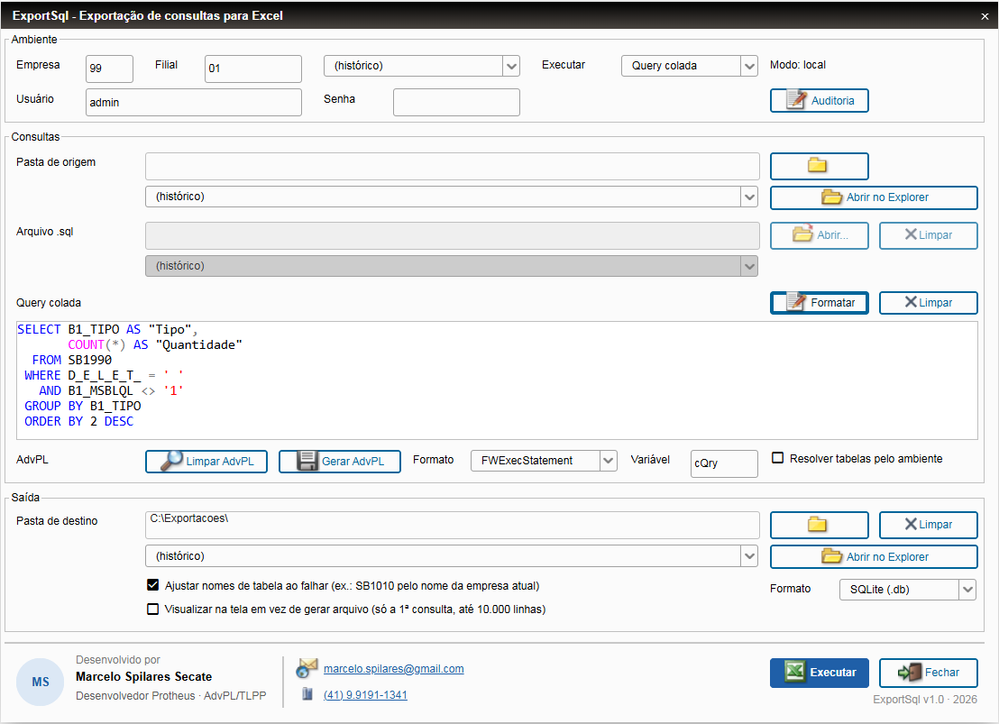

# ExportSql

Consultas SQL dentro do TOTVS Protheus, com exportação para **Excel (.xlsx)** ou **.sdb do Protheus** (SQLite, o mesmo formato do APSDU) e visualização na tela.

**Site:** https://marcelosecate.github.io/ExportSql/

## Download

- Patch: [download/exportsql_v1_0.ptm](https://github.com/marcelosecate/ExportSql/raw/main/download/exportsql_v1_0.ptm)
- Instalação e uso: [LEIA-ME.txt](LEIA-ME.txt)

Testado no Protheus 12.1.2510 (AppServer 7.00.240223P) com SQL Server, pelo SmartClient webapp.

## Recursos

- Uma ou várias consultas (arquivo .sql ou query colada), um arquivo por consulta.
- Excel: .xlsx com a query documentada numa aba.
- .sdb: o arquivo local do Protheus (o mesmo do APSDU), com tipos e tamanhos de cada campo, para filtrar registros por SQL numa base e importar em outra; um .txt ao lado guarda a query executada.
- Visualização do resultado na tela, em grade, até 10.000 linhas.
- Editor com cores no estilo do SQL Server Management Studio e botão Formatar.
- Conversão de query para código AdvPL (String, BeginSql ou FWExecStatement) e o caminho inverso.
- Somente consultas: comandos de alteração são bloqueados.
- Datas e números tipados pelo dicionário (SX3) e ajuste automático de nomes de tabela entre empresas.
- Acesso com usuário e senha do Protheus, restrito ao grupo Administradores, com auditoria de cada execução.

## Como usar

1. Faça backup do RPO e aplique o patch `exportsql_v1_0.ptm`.
2. No SmartClient ou no webapp, informe o programa inicial `U_SPILR01`.
3. Entre com empresa, filial e um usuário do grupo Administradores.

Detalhes, segurança e limitações conhecidas no [LEIA-ME.txt](LEIA-ME.txt).

## Licença

Gratuito, sob a [licença MIT](LICENSE): fornecido como está, sem garantia.

Protheus e TOTVS são marcas da TOTVS S.A. Este projeto não é afiliado à TOTVS.

## Autor

Marcelo Spilares Secate · SpilSoft
marcelo.spilares@gmail.com · WhatsApp (41) 9.9191-1341
